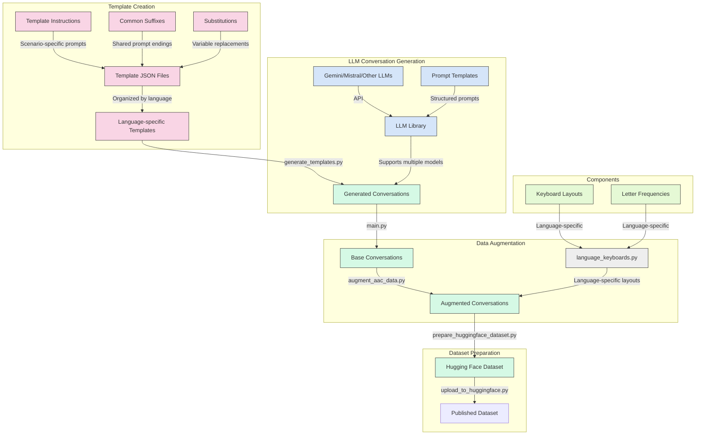

# AACDataSet

A comprehensive dataset of synthesized Augmentative and Alternative Communication (AAC) conversations for adults with ALS/MND, focusing on realistic communication scenarios using eye-gaze, direct selection, and headmouse with keyboard-based systems.

**Warning**: This dataset contains simulated conversations and should not be used for real-world applications without proper validation and testing. The data is intended for research purposes only. Its ALL WIP and not yet verified. - we are using the English-GB data as a test case for now. Other data really exists as a proof of concept but needs work.

## Overview

This dataset contains simulated conversations between AAC users with ALS and various communication partners (healthcare providers, family members, strangers, etc.). The conversations are designed to represent realistic communication scenarios and include both the actual AAC utterances and their intended meanings, along with various augmented versions to simulate typing errors and corrections.

## Dataset Focus

- **Primary User Group**: Adults with ALS (Amyotrophic Lateral Sclerosis - also known as MND - Motor Neuron Disease)
- **Communication Partners**: Healthcare providers, family members, strangers, etc.
- **Conversation Types**:
  - Medical scenarios (majority)
  - Everyday life situations (minority)
- **User Characteristics**:
  - Early-stage ALS (majority)
  - Late-stage ALS (minority)
  - Older adults (minority)
- **User Needs**:
  - Basic needs (majority)
  - Social interaction (minority)
- **Culture and Language**: English (majority), But prompts supporting diverse cultural and ethnic backgrounds are included.
- **Communication Contexts**:
  - Medical appointments (majority)
  - Social interactions (minority)
  - Everyday life situations (minority)
- **Access Methods**:
  - Eye-gaze tracking
  - Direct selection
  - Headmouse
- **Interface Types**:
  - QWERTY keyboard layouts (majority)
  - ABC layouts (primarily for older adults)
  - Phrase-based systems (minority)

## Data Structure

The dataset is stored in JSONL format (JSON Lines), with each line containing a complete conversation. Each conversation includes:

- **template_id**: The template used to generate the conversation
- **scene**: A brief description of the setting and participants
- **conversation**: An array of conversation turns
- **metadata**: Information about how the conversation was generated

For AAC user turns, the following fields are included:

- **utterance**: The original AAC message as it would appear on the device
- **utterance_intended**: The full intended meaning of the message
- **noisy_utterance**: A version with random typing errors
- **noisy_utterance_qwerty**: Errors based on QWERTY keyboard adjacency
- **noisy_utterance_abc**: Errors based on ABC keyboard layout
- **noisy_utterance_frequency**: Errors based on frequency keyboard layout
- **minimally_corrected**: Basic capitalization and punctuation correction
- **fully_corrected**: Complete grammatical correction

## Example Data

```json
{
  "utterance": "Need water please",
  "utterance_intended": "I need some water, please.",
  "noisy_utterance": "Nee watr plese",
  "noisy_utterance_qwerty": "Nerd wayer pkease",
  "noisy_utterance_abc": "Neef wate rplease",
  "noisy_utterance_frequency": "Need wate rplase",
  "minimally_corrected": "Need water please.",
  "fully_corrected": "I need some water, please."
}
```

## Files

- `output/aac_conversations_en.jsonl`: Original generated conversations
- `output/augmented_aac_conversations_en.jsonl`: Conversations with augmented AAC utterances
- `prompt_templates/en.json`: Templates used to generate conversations
- `substitutions/en.json`: Substitution values for conversation generation
- `scanning_library.py`: Utilities for simulating different keyboard layouts
- `metrics.py`: Metrics for evaluating AAC communication
- `main.py`: Script for generating conversations
- `augment_aac_data.py`: Script for augmenting AAC utterances
- `huggingface/`: Scripts and documentation for preparing the dataset for Hugging Face

## Usage

### Creating Prompt Templates

```bash
python generate_templates.py
```

This will create the prompt templates in the `prompt_templates/` directory. The script will ask for a language code (e.g., `en`, `fr`, etc.) and generate the necessary files. Note you can skip this step - we are committing our prompt templates for now.

### Generating Conversations

```bash
python main.py --lang en --num_variations 3
```

This will generate new conversations using the templates in `prompt_templates/en.json` and save them to `output/aac_conversations_en.jsonl`.

For locale-specific language codes:

```bash
python main.py --lang en-GB --num_variations 3
```

This will use templates from `prompt_templates/en-GB.json` if available, or fall back to `prompt_templates/en.json` if not. The output will be saved to `output/aac_conversations_en-GB.jsonl`.

### Augmenting Conversations

```bash
python augment_aac_data.py --input output/aac_conversations_en.jsonl
```

This will read the conversations from the input file, augment the AAC utterances with noisy versions and corrections, and save the result to `output/augmented_aac_conversations_en.jsonl`. Read the code carefully. We are being careful about the amount of augmenting we are doing here and we havent verified these rates in the typical population. We are using a 10% error rate for the noisy utterance, and a 5% error rate for the qwerty and abc layouts. The frequency layout is set to 1% error rate. The minimally corrected version is set to 5% error rate, and the fully corrected version is set to 0% error rate. The minimally corrected version is a basic capitalization and punctuation correction, while the fully corrected version is a complete grammatical correction. Note too - this data needs work for languages other than English. We are using the English data as a test case for now. Note too we arent augmenting any more grammar errors. Thats because much of the input might be poor grammatically already  but we need to consider this more

For locale-specific language codes:

```bash
python augment_aac_data.py --input output/aac_conversations_en-GB.jsonl
```

The output will automatically be saved to `output/augmented_aac_conversations_en-GB.jsonl`.

### Preparing for Hugging Face

```bash
cd huggingface/scripts
python prepare_huggingface_dataset.py --input ../../output/augmented_aac_conversations_en.jsonl --output_dir ../data
```

This will convert the augmented conversations to a format suitable for Hugging Face datasets, splitting the data into train, validation, and test sets. See the [Hugging Face README](huggingface/README.md) for more details.

## Technical Details

The conversation generation process uses a JSON schema to ensure consistent structure in the LLM responses. The schema defines:

```json
{
    "type": "object",
    "properties": {
        "template_id": {"type": "integer"},
        "scene": {"type": "string"},
        "conversation": {
            "type": "array",
            "items": {
                "type": "object",
                "properties": {
                    "speaker": {"type": "string"},
                    "utterance": {"type": "string"},
                    "utterance_intended": {"type": "string"}
                },
                "required": ["speaker", "utterance", "utterance_intended"]
            }
        }
    },
    "required": ["template_id", "scene", "conversation"]
}
```

This schema is used directly in the LLM prompt to ensure proper structure in the generated conversations.

## Applications

This dataset can be used for:

1. Training AAC prediction models
2. Developing error correction algorithms
3. Studying patterns in AAC communication
4. Testing the robustness of AAC interfaces
5. Simulating AAC communication for training healthcare providers
6. Developing more efficient AAC interfaces


## Language Codes Supported

The following table shows the language codes supported by the AAC Dataset, along with their implementation status:

| Language Code | Language | Prompts Created | Verified |
|--------------|----------|----------------|----------|
| af-ZA | Afrikaans (South Africa) | ❌ | ❌ |
| ar-SA | Arabic (Saudi Arabia) | ✅ | ❌ |
| eu-ES | Basque (Spain) | ❌ | ❌ |
| ca-ES | Catalan (Spain) | ❌ | ❌ |
| hr-HR | Croatian (Croatia) | ❌ | ❌ |
| cs-CZ | Czech (Czechia) | ❌ | ❌ |
| da-DK | Danish (Denmark) | ❌ | ❌ |
| nl-BE | Dutch (Belgium) | ❌ | ❌ |
| nl-NL | Dutch (Netherlands) | ✅ | ❌ |
| en-AU | English (Australia) | ❌ | ❌ |
| en-CA | English (Canada) | ❌ | ❌ |
| en-NZ | English (New Zealand) | ❌ | ❌ |
| en-ZA | English (South Africa) | ❌ | ❌ |
| en-GB | English (United Kingdom) | ✅ | ❌ |
| en-US | English (United States) | ✅ | ❌ |
| fo-FO | Faroese (Faroe Islands) | ❌ | ❌ |
| fi-FI | Finnish (Finland) | ❌ | ❌ |
| fr-CA | French (Canada) | ❌ | ❌ |
| fr-FR | French (France) | ✅ | ❌ |
| de-AT | German (Austria) | ❌ | ❌ |
| de-DE | German (Germany) | ✅ | ❌ |
| el-GR | Greek (Greece) | ✅ | ❌ |
| he-IL | Hebrew (Israel) | ✅ | ❌ |
| it-IT | Italian (Italy) | ✅ | ❌ |
| nb-NO | Norwegian Bokmål (Norway) | ❌ | ❌ |
| pl-PL | Polish (Poland) | ❌ | ❌ |
| pt-BR | Portuguese (Brazil) | ✅ | ❌ |
| pt-PT | Portuguese (Portugal) | ❌ | ❌ |
| ru-RU | Russian (Russia) | ✅ | ❌ |
| sk-SK | Slovak (Slovakia) | ❌ | ❌ |
| sl-SI | Slovenian (Slovenia) | ❌ | ❌ |
| es-ES | Spanish (Spain) | ✅ | ❌ |
| es-US | Spanish (United States) | ❌ | ❌ |
| sv-SE | Swedish (Sweden) | ❌ | ❌ |
| uk-UA | Ukrainian (Ukraine) | ❌ | ❌ |
| cy-GB | Welsh (United Kingdom) | ✅ | ❌ |
| zh-CN | Chinese (China) | ✅ | ❌ |
| ja-JP | Japanese (Japan) | ✅ | ❌ |
| ko-KR | Korean (Korea) | ❌ | ❌ |

- ✅ Prompts Created: Language has prompt templates and substitutions files
- ✅ Verified: Language has been tested and verified for quality


# AAC Conversations Dataset Creation Process

The following diagram illustrates the data flow and tools used to create the AAC Conversations Dataset:



## Detailed Process Description

### 1. Template Creation
- **Template JSON Files**: Initial conversation templates are created in JSON format
- **Language-specific Templates**: Templates are organized by language code (e.g., en-GB, fr-FR)
- **Template Instructions**: Scenario-specific prompts that define the conversation context and goals
- **Common Suffixes**: Reusable prompt endings that are shared across multiple templates
- **Substitutions**: Variable replacements that allow for customization of templates

### 2. LLM Conversation Generation
- **generate_templates.py**: Script that processes templates and uses LLMs to generate realistic conversations
- **LLM Library**: Flexible library that supports multiple LLM providers
- **LLM Models**: Can use various models including Gemini, Mistral, and others
- **Prompt Templates**: Structured prompts that guide the LLM to generate appropriate conversations

### 3. Data Augmentation
- **main.py**: Orchestrates the overall process and calls other scripts
- **language_keyboards.py**: Provides keyboard layouts and letter frequencies for different languages
- **augment_aac_data.py**: Adds noisy variations to AAC utterances based on different keyboard layouts and error rates

### 4. Dataset Preparation
- **prepare_huggingface_dataset.py**: Flattens and structures the data for Hugging Face, adding conversation IDs and turn numbers
- **upload_to_huggingface.py**: Uploads the prepared dataset to Hugging Face

### 5. Components
- **Template Structure**:
  - **Template Instructions**: JSON files containing scenario-specific prompts
  - **Common Suffixes**: Reusable prompt endings stored in separate files
  - **Substitutions**: Variable definitions for template customization
- **Keyboard Layouts**: Different keyboard layouts (QWERTY, ABC, etc.) for each language
- **Letter Frequencies**: Character frequency distributions for each language

## Data Flow

1. Templates are created and organized by language
2. Templates are processed by the LLM library using structured prompts
3. LLMs (Gemini, Mistral, etc.) generate realistic conversations based on the templates
4. AAC utterances in the conversations are augmented with noisy variations (regionalized for each language with appropriate keyboard layouts)
5. The augmented conversations are flattened and structured for Hugging Face
6. The dataset is uploaded to Hugging Face

This process ensures that the dataset includes a diverse range of conversations across multiple languages, with realistic variations in AAC utterances that simulate different typing errors and keyboard layouts. The use of a flexible LLM library allows for experimentation with different models to find the best balance of quality, diversity, and computational efficiency.

## License

[Insert appropriate license information here]

## Citation

If you use this dataset in your research, please cite:

```
[Insert citation information here]
```

## Acknowledgments

This dataset was created to support research and development in the field of Augmentative and Alternative Communication, with a focus on improving communication options for adults with ALS.
