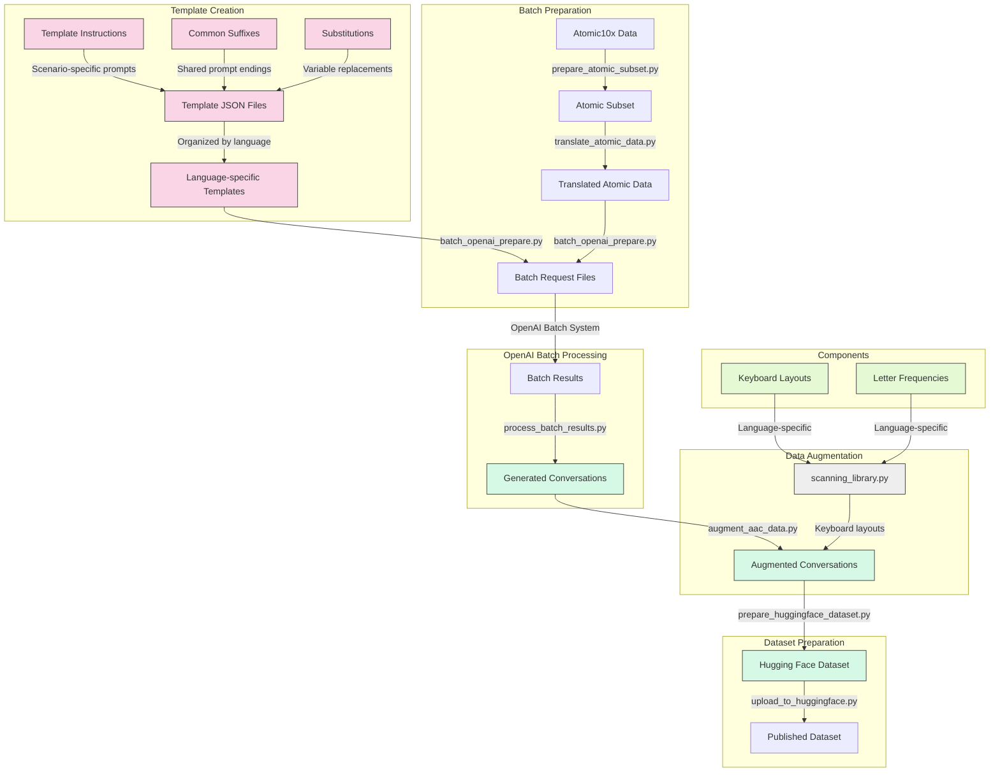

# AACDataSet

A comprehensive dataset of synthesized Augmentative and Alternative Communication (AAC) conversations for adults with ALS/MND, focusing on realistic communication scenarios using eye-gaze, direct selection, and headmouse with keyboard-based systems.

**Warning**: This dataset contains simulated conversations and should not be used for real-world applications without proper validation and testing. The data is intended for research purposes only. Its ALL WIP and not yet verified. - we are using the English-GB data as a test case for now. Other data really exists as a proof of concept but needs work.

## Overview

This dataset contains simulated conversations between AAC users with ALS and various communication partners (healthcare providers, family members, strangers, etc.). The conversations are designed to represent realistic communication scenarios and include both the actual AAC utterances and their intended meanings, along with various augmented versions to simulate typing errors and corrections.

## Dataset Focus

- **Primary User Group**: Adults with ALS (Amyotrophic Lateral Sclerosis - also known as MND - Motor Neuron Disease)
- **Communication Partners**: Healthcare providers, family members, strangers, etc.
- **Conversation Types**:
  - Medical scenarios (majority)
  - Everyday life situations (minority)
- **User Characteristics**:
  - Early-stage ALS (majority)
  - Late-stage ALS (minority)
  - Older adults (minority)
- **User Needs**:
  - Basic needs (majority)
  - Social interaction (minority)
- **Culture and Language**: English (majority), But prompts supporting diverse cultural and ethnic backgrounds are included.
- **Communication Contexts**:
  - Medical appointments (majority)
  - Social interactions (minority)
  - Everyday life situations (minority)
- **Access Methods**:
  - Eye-gaze tracking
  - Direct selection
  - Headmouse
- **Interface Types**:
  - QWERTY keyboard layouts (majority)
  - ABC layouts (primarily for older adults)
  - Phrase-based systems (minority)

## Data Structure

The dataset is stored in JSONL format (JSON Lines), with each line containing a complete conversation. Each conversation includes:

- **template_id**: The template used to generate the conversation
- **scene**: A brief description of the setting and participants
- **conversation**: An array of conversation turns
- **metadata**: Information about how the conversation was generated

For AAC user turns, the following fields are included:

- **utterance**: The original AAC message as it would appear on the device
- **utterance_intended**: The full intended meaning of the message

---

## Customizing Prompts and Substitutions

**To change or tweak the prompts generated for each language, you only need to edit:**

- `templates/instructions/<lang>.json` — Controls the prompt templates (instructions) for each language.
- `templates/substitutions/<lang>.json` — Controls the possible substitutions (e.g., time_of_day, setting, tone, etc.) for each language.
  - Each language file includes culturally appropriate names for AAC users and partners in the `aac_user` and `partner` arrays.

**Do NOT edit `templates/prompt_templates/` directly.**
- The files in `templates/prompt_templates/` are generated automatically by the script (`scripts/generate_templates.py`) based on the above two folders. Any changes you want to make should be made in `templates/instructions` or `templates/substitutions` and then regenerate the prompt templates.

**Summary:**
- Edit `templates/instructions/` and `templates/substitutions/` for your language(s)
- Run `scripts/generate_templates.py` to regenerate all prompt templates
- `templates/prompt_templates/` will be overwritten automatically

---

- **noisy_utterance**: A version with random typing errors
- **noisy_utterance_qwerty**: Errors based on QWERTY keyboard adjacency
- **noisy_utterance_abc**: Errors based on ABC keyboard layout
- **noisy_utterance_frequency**: Errors based on frequency keyboard layout
- **minimally_corrected**: Basic capitalization and punctuation correction
- **fully_corrected**: Complete grammatical correction

## Example Data

```json
{
  "utterance": "Need water please",
  "utterance_intended": "I need some water, please.",
  "noisy_utterance": "Nee watr plese",
  "noisy_utterance_qwerty": "Nerd wayer pkease",
  "noisy_utterance_abc": "Neef wate rplease",
  "noisy_utterance_frequency": "Need wate rplase",
  "minimally_corrected": "Need water please.",
  "fully_corrected": "I need some water, please."
}
```

## Files

- `data/output/aac_conversations_en.jsonl`: Original generated conversations
- `data/output/augmented_aac_conversations_en.jsonl`: Conversations with augmented AAC utterances
- `templates/prompt_templates/en.json`: Templates used to generate conversations
- `templates/substitutions/en.json`: Substitution values for conversation generation
- `scripts/scanning_library.py`: Utilities for simulating different keyboard layouts
- `scripts/metrics.py`: Metrics for evaluating AAC communication
- `scripts/atomic10x_batch_wrapper.py`: Main workflow script for batch processing
- `scripts/batch_openai_prepare.py`: Script for preparing batch requests
- `scripts/process_batch_results.py`: Script for processing batch results
- `scripts/augment_aac_data.py`: Script for augmenting AAC utterances
- `huggingface/`: Scripts and documentation for preparing the dataset for Hugging Face
- `scripts/`: All main workflow scripts (including batch and processing scripts)
- `scripts/archive/`: Archived scripts that are no longer part of the main workflow
- `templates/`: Prompt templates and instructions
- `data/`: All generated output, batch, and error files
- `requirements.txt`: Python dependencies for all scripts

## Usage

### Creating Prompt Templates

```bash
uv venv
uv pip install -r requirements.txt
uv pip install uv
```

### Generating Prompt Templates

```bash
uv python scripts/generate_templates.py
```

This will create the prompt templates in `templates/prompt_templates/`. The script will ask for a language code (e.g., `en`, `fr`, etc.) and generate the necessary files. You can skip this step if you are using the committed prompt templates.

### Generating Conversations

#### Batch Generation Approach

** Warning: This step relies on the subset data being translated. See scripts/gemini_translate_templates for this. It takes a LONG time to do this **

```bash
uv python scripts/atomic10x_batch_wrapper.py --languages en-GB --num_batches 10 --requests_per_batch 100 --prepare_only
```

This will generate batch files for OpenAI's batch processing system. After processing the batch files with OpenAI, you can process the results with:

```bash
uv python scripts/atomic10x_batch_wrapper.py --process_from_batch path/to/downloaded_results.json
```

For more details on the batch processing workflow, see the [Batch Processing Workflow](docs/batch_processing_workflow.md) documentation.

#### Direct Multilingual Generation Approach

For more efficient multilingual conversation generation without the translation step, use the direct generation script:

```bash
python scripts/direct_multilingual_generate.py --lang fr-FR --num 10
```

This will directly generate 10 conversations in French. You can also generate for all supported languages:

```bash
python scripts/direct_multilingual_generate.py --lang all --num 5
```

Instead of running directly you can just create batch files endings

```bash
python scripts/direct_multilingual_generate.py --lang en-GB --num 100 --provider openai --batch-prepare
```

For more details, see the [README_multilingual_generation.md](scripts/README_multilingual_generation.md) documentation.

### Processing Batch Results
After processing the batch results, you can process the results with:

```bash
# Transform the OpenAI batch output to the format expected by the augmentation script
python scripts/transform_batch_output.py path/to/batch_output.jsonl

# This will create a transformed file at path/to/batch_output_transformed.jsonl

# Then augment the data with realistic AAC errors
python scripts/augment_aac_data.py --input path/to/batch_output_transformed.jsonl --lang [language-code]

# This will create an augmented file at path/to/augmented_batch_conversations_transformed.jsonl
```

The workflow is:
1. Generate batch files with `direct_multilingual_generate.py --lang [language-code] --batch-prepare --num [count]`
2. Process the batch files with OpenAI's API
3. Transform the output with `transform_batch_output.py`
4. Augment the data with `augment_aac_data.py`
### Augmenting AAC Data

After processing the batch results, you can augment the AAC utterances with noisy versions and corrections:

```bash
uv python scripts/augment_aac_data.py --input data/output/aac_conversations_en-GB.jsonl
```

This will read the conversations from the input file, augment the AAC utterances with noisy versions and corrections, and save the result to `data/output/augmented_aac_conversations_en-GB.jsonl`. The augmentation process introduces errors at rates proportional to both the specified error rate and the length of the utterance, ensuring at least one character deletion or addition in each augmented sentence. The augmentation rates are:

- **minimal**: 5% errors - very mild typing issues
- **light**: 15% errors - noticeable but clearly readable
- **moderate**: 25% errors - challenging but comprehensible
- **severe**: 35% errors - significant difficulty

Note: this data needs work for languages other than English. We are using the English data as a test case for now.

The output will automatically be saved to `data/output/augmented_aac_conversations_en-GB.jsonl`.

### Preparing for Hugging Face

```bash
cd huggingface/scripts
uv python prepare_huggingface_dataset.py --input ../../data/output/augmented_aac_conversations_en.jsonl --output_dir ../data
```

This will convert the augmented conversations to a format suitable for Hugging Face datasets, splitting the data into train, validation, and test sets. See the [Hugging Face README](huggingface/README.md) for more details.

## Technical Details

The conversation generation process uses a JSON schema to ensure consistent structure in the LLM responses. The schema defines:

```json
{
    "type": "object",
    "properties": {
        "template_id": {"type": "integer"},
        "scene": {"type": "string"},
        "conversation": {
            "type": "array",
            "items": {
                "type": "object",
                "properties": {
                    "speaker": {"type": "string"},
                    "utterance": {"type": "string"},
                    "utterance_intended": {"type": "string"}
                },
                "required": ["speaker", "utterance", "utterance_intended"]
            }
        }
    },
    "required": ["template_id", "scene", "conversation"]
}
```

This schema is used directly in the LLM prompt to ensure proper structure in the generated conversations.

## Applications

This dataset can be used for:

1. Training AAC prediction models
2. Developing error correction algorithms
3. Studying patterns in AAC communication
4. Testing the robustness of AAC interfaces
5. Simulating AAC communication for training healthcare providers
6. Developing more efficient AAC interfaces


## Language Codes Supported

The AAC Dataset supports multiple languages through substitution files, atomic data translation, and language-specific keyboard layouts. The following table shows the current implementation status:

| Language Code | Language | Prompts Created | Verified |
|--------------|----------|----------------|----------|
| af-ZA | Afrikaans (South Africa) | ❌ | ❌ |
| ar-SA | Arabic (Saudi Arabia) | ✅ | ❌ |
| eu-ES | Basque (Spain) | ❌ | ❌ |
| ca-ES | Catalan (Spain) | ❌ | ❌ |
| hr-HR | Croatian (Croatia) | ❌ | ❌ |
| cs-CZ | Czech (Czechia) | ❌ | ❌ |
| da-DK | Danish (Denmark) | ❌ | ❌ |
| nl-BE | Dutch (Belgium) | ❌ | ❌ |
| nl-NL | Dutch (Netherlands) | ✅ | ❌ |
| en-AU | English (Australia) | ❌ | ❌ |
| en-CA | English (Canada) | ❌ | ❌ |
| en-NZ | English (New Zealand) | ❌ | ❌ |
| en-ZA | English (South Africa) | ❌ | ❌ |
| en-GB | English (United Kingdom) | ✅ | ❌ |
| en-US | English (United States) | ✅ | ❌ |
| fo-FO | Faroese (Faroe Islands) | ❌ | ❌ |
| fi-FI | Finnish (Finland) | ❌ | ❌ |
| fr-CA | French (Canada) | ❌ | ❌ |
| fr-FR | French (France) | ✅ | ❌ |
| de-AT | German (Austria) | ❌ | ❌ |
| de-DE | German (Germany) | ✅ | ❌ |
| el-GR | Greek (Greece) | ✅ | ❌ |
| he-IL | Hebrew (Israel) | ✅ | ❌ |
| it-IT | Italian (Italy) | ✅ | ❌ |
| nb-NO | Norwegian Bokmål (Norway) | ❌ | ❌ |
| pl-PL | Polish (Poland) | ❌ | ❌ |
| pt-BR | Portuguese (Brazil) | ✅ | ❌ |
| pt-PT | Portuguese (Portugal) | ❌ | ❌ |
| ru-RU | Russian (Russia) | ✅ | ❌ |
| sk-SK | Slovak (Slovakia) | ❌ | ❌ |
| sl-SI | Slovenian (Slovenia) | ❌ | ❌ |
| es-ES | Spanish (Spain) | ✅ | ❌ |
| es-US | Spanish (United States) | ❌ | ❌ |
| sv-SE | Swedish (Sweden) | ❌ | ❌ |
| uk-UA | Ukrainian (Ukraine) | ❌ | ❌ |
| cy-GB | Welsh (United Kingdom) | ✅ | ❌ |
| zh-CN | Chinese (China) | ✅ | ❌ |
| ja-JP | Japanese (Japan) | ✅ | ❌ |
| ko-KR | Korean (Korea) | ❌ | ❌ |

- ✅ Prompts Created: Language has prompt templates and substitutions files
- ✅ Verified: Language has been tested and verified for quality

For more information on adding support for new languages, see the [Language Support Documentation](docs/language_support.md).


# AAC Conversations Dataset Creation Process

The following diagram illustrates the data flow and tools used to create the AAC Conversations Dataset:



## Detailed Process Description

### 1. Template Creation
- **Template JSON Files**: Initial conversation templates are created in JSON format
- **Language-specific Templates**: Templates are organized by language code (e.g., en-GB, fr-FR)
- **Template Instructions**: Scenario-specific prompts that define the conversation context and goals
- **Common Suffixes**: Reusable prompt endings that are shared across multiple templates
- **Substitutions**: Variable replacements that allow for customization of templates

### 2. Batch Preparation
- **prepare_atomic_subset.py**: Prepares a subset of Atomic10x data for use in conversation generation
- **translate_atomic_data.py**: Translates the Atomic10x data into different languages
- **batch_openai_prepare.py**: Creates batch request files for OpenAI's batch processing system
- **atomic10x_batch_wrapper.py**: Orchestrates the entire workflow from preparation to processing

### 3. OpenAI Batch Processing
- **OpenAI Batch System**: Processes the batch requests in a cost-effective manner
- **process_batch_results.py**: Processes the results from OpenAI's batch system
- **process_batch.py**: Alternative script for processing batch requests directly (for testing)
- **direct_multilingual_generate.py**: Directly generates conversations in target languages without the translation step

### 4. Data Augmentation
- **augment_aac_data.py**: Adds noisy variations to AAC utterances based on different keyboard layouts and error rates
  - Ensures error severity is proportional to both error rate and utterance length
  - Guarantees at least one character deletion or addition in each augmented sentence
  - Provides four levels of error severity: minimal (5%), light (15%), moderate (25%), and severe (35%)
- **scanning_library.py**: Provides keyboard layouts and letter frequencies for different languages

### 5. Dataset Preparation
- **prepare_huggingface_dataset.py**: Flattens and structures the data for Hugging Face, adding conversation IDs and turn numbers
- **upload_to_huggingface.py**: Uploads the prepared dataset to Hugging Face

### 6. Components
- **Template Structure**:
  - **Template Instructions**: JSON files containing scenario-specific prompts
  - **Common Suffixes**: Reusable prompt endings stored in separate files
  - **Substitutions**: Variable definitions for template customization
- **Keyboard Layouts**: Different keyboard layouts (QWERTY, ABC, etc.) for each language
- **Letter Frequencies**: Character frequency distributions for each language
- **Language-specific Resources**:
  - **Language Instructions**: Prompts in each target language
  - **Language Substitutions**: Names and terms appropriate for each culture/language

## Multilingual Generation Approaches

The dataset supports two approaches for generating multilingual conversations:

### 1. Generate and Translate Approach
- Generate conversations in English
- Translate using Gemini API (gemini_translate_templates.py)
- Pros: Consistent with original English dataset
- Cons: More resource-intensive, potential translation artifacts

### 2. Direct Generation Approach
- Generate conversations directly in target languages
- Uses language-specific templates and substitutions
- Pros: More natural in target language, more efficient, lower cost
- Cons: May diverge stylistically from English dataset

For new languages, the direct generation approach is recommended.

## Data Flow

1. Templates are created and organized by language
2. Atomic10x data is prepared and translated for each language
3. Batch request files are generated using the templates and atomic data
4. Batch files are processed by OpenAI's batch processing system
5. Batch results are processed to extract conversations
6. AAC utterances in the conversations are augmented with noisy variations (regionalized for each language with appropriate keyboard layouts)
7. The augmented conversations are flattened and structured for Hugging Face
8. The dataset is uploaded to Hugging Face

This process ensures that the dataset includes a diverse range of conversations across multiple languages, with realistic variations in AAC utterances that simulate different typing errors and keyboard layouts. The use of OpenAI's batch processing system allows for cost-effective generation of large amounts of data, while the modular workflow enables experimentation with different models and parameters.

## License

[Insert appropriate license information here]

## Citation

If you use this dataset in your research, please cite:

```
[Insert citation information here]
```

## Acknowledgments

This dataset was created to support research and development in the field of Augmentative and Alternative Communication, with a focus on improving communication options for adults with ALS.
